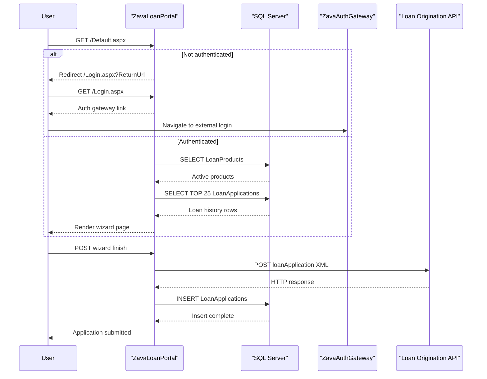

# API & Service Communication Contracts

The application exposes page-driven HTTP entry points and integrates with external authentication and loan origination services through synchronous HTTP communication.

## Service Catalog

| Service | Port | Category | Purpose |
|---|---|---|---|
| ZavaLoanPortal | 8080 (Docker xsp4) | API Layer | Serves Web Forms pages for loan application and history |
| ZavaAuthGateway (external) | Not declared in repo | Infrastructure | Handles centralized login and logout flows |
| Loan Origination API (external) | 8080 in configured URL host | Business | Receives submitted loan application payloads |

## API Endpoints Inventory

| Service | Method | Path | Request Type | Response Type |
|---|---|---|---|---|
| ZavaLoanPortal | GET | /Default.aspx | Cookie auth + query string | HTML page |
| ZavaLoanPortal | POST | /Default.aspx | Web Forms postback fields | HTML page update |
| ZavaLoanPortal | GET | /Login.aspx | Query `ReturnUrl` | HTML page with auth redirect link |
| ZavaLoanPortal | GET | /Logout.aspx | None | Redirect response |

## Management & Observability Endpoints

| Service | Endpoint | Custom Metrics (if any) |
|---|---|---|
| ZavaLoanPortal | None detected | None detected |

## DTOs & Contracts

The internal page handlers build an XML contract for outbound loan origination submissions using a `loanApplication` payload with customer and loan identifiers, requested amount, and term months. Domain-facing types are implicit through page fields and SQL rows rather than explicit DTO classes. Serialization is performed manually through string composition for XML and Web Forms form-post state for inbound requests.

## Communication Patterns

Communication is synchronous throughout: browser to Web Forms pages, page handlers to SQL Server using ADO.NET, and page handlers to the external loan API using `HttpWebRequest`. There is no asynchronous messaging, service discovery, retry policy, circuit breaker, or timeout policy configuration detected in code. Security posture is based on Forms Authentication for portal pages; TLS enforcement and API-level authorization controls are not explicitly configured in repository code.

## Service Technology Matrix

| Service | Web | Data Access | Discovery | Gateway | Actuator | Cache | Metrics |
|---|---|---|---|---|---|---|---|
| ZavaLoanPortal | ASP.NET Web Forms | ADO.NET SqlClient | None | None | None | None | None |

## Service Communication Sequence

