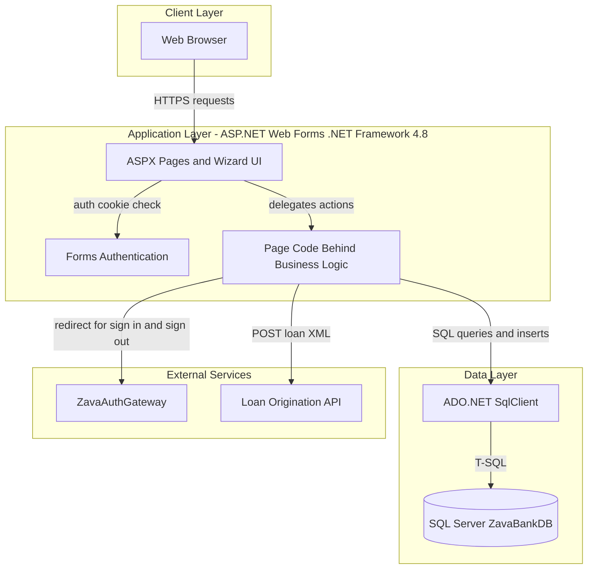
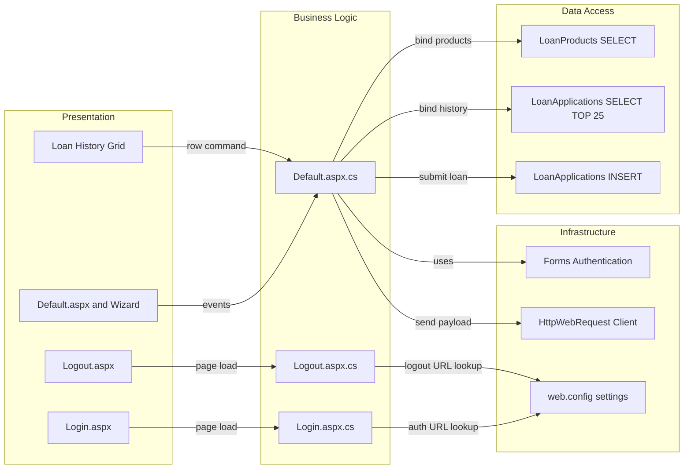

# Architecture Diagram

This repository is a .NET Framework Web Forms loan portal with a server-rendered UI, direct SQL Server access, and outbound HTTP integration to an external loan origination API.

## Application Architecture

### Technology Stack Summary

| Layer | Technology | Version | Purpose |
|---|---|---|---|
| Presentation | ASP.NET Web Forms | .NET Framework 4.8 | Server rendered pages and wizard workflow |
| Authentication | Forms Authentication | .NET Framework 4.8 | Auth cookie based access control |
| Business Logic | C# code behind pages | .NET Framework 4.8 | Handles workflow steps and submission actions |
| Data Access | ADO.NET SqlClient | System.Data | Executes SQL reads and writes |
| Data Storage | SQL Server | Not pinned in repo | Stores loan products and loan applications |
| External Integration | HTTP WebRequest | System.Net | Sends loan applications to origination API |

### Data Storage & External Services

The application persists loan product and application records in SQL Server using a single configured connection string. It also depends on external services for authentication redirection and loan origination submission via an HTTP endpoint.

### Key Architectural Decisions

- Uses ASP.NET Web Forms page lifecycle and event handlers instead of controller based APIs.
- Uses direct SQL in code behind with ADO.NET rather than repository or ORM abstractions.
- Uses forms authentication with explicit allow rules for login and logout pages.

## Component Relationships

### Component Inventory

| Component | Layer | Type | Responsibility |
|---|---|---|---|
| Default.aspx | Presentation | Web Forms Page | Hosts loan application wizard and history grid |
| Default.aspx.cs | Business Logic | Page code behind | Validates step input, saves application, calls external API |
| Login.aspx.cs | Business Logic | Page code behind | Redirects unauthenticated users to auth gateway |
| Logout.aspx.cs | Business Logic | Page code behind | Signs out local auth and redirects to auth gateway logout |
| LoanProducts query | Data Access | SQL query | Loads active loan products for selection |
| LoanApplications insert | Data Access | SQL command | Persists submitted loan applications |
| Loan API client | Infrastructure | HTTP client integration | Posts XML loan submission payload |
| Forms authentication | Infrastructure | Security middleware | Enforces authenticated access to protected pages |
