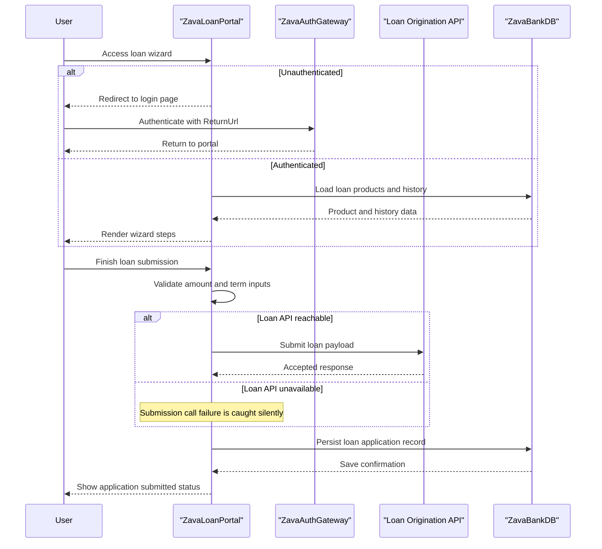

# Core Business Workflows

The portal supports loan application intake and review history for authenticated users, coordinating user inputs, eligibility checks, and downstream submission to lending systems.

## Domain Entities

| Entity | Service / Bounded Context | Description | Key Relationships |
|---|---|---|---|
| Loan Application | Loan Processing | Captures a customer request for lending approval | Linked to selected loan product and submitter context |
| Loan Product | Product Catalog | Represents available lending product options | Referenced by loan applications |
| Customer Session | Access Management | Represents authenticated portal usage context | Required for accessing submission workflow |

## Service-to-Domain Mapping

| Service | Domain Context | Owned Entities | External Dependencies |
|---|---|---|---|
| ZavaLoanPortal | Loan Intake and Tracking | Loan Application, Loan Product | SQL Server, ZavaAuthGateway, Loan Origination API |

## Primary Workflows

### Workflow 1: Submit New Loan Application

An authenticated user completes a multi-step wizard for personal, employment, and loan details. The portal validates key numeric values before final submission, sends a loan payload to the origination API, writes the application record to the local database, then resets the wizard and refreshes history.

### Workflow 2: Review Recent Loan History

On page load and after submission, the portal queries the latest loan application rows and presents them in a grid. Selecting a row triggers a review action acknowledgment for follow-up handling.

## Cross-Service Data Flows

The portal is the aggregation point for user interaction and combines data from local SQL reads with outbound workflow submission to the external loan origination API. If external authentication is required, users are redirected to ZavaAuthGateway before workflow access. If the loan API call fails, local error handling swallows exceptions and the business flow degrades by continuing without surfacing upstream integration diagnostics.

## Business Workflow Sequence

## Business Rules & Decision Logic

- Access control rule: unauthenticated requests are redirected to login with ReturnUrl preservation.
- Validation rule: requested amount and term months must parse to numeric values before progressing from loan details step.
- Submission rule: wizard completion triggers external loan API submission attempt followed by local database insert.
- State rule: new records are inserted with status `Submitted` and current timestamps.
- Error handling rule: external submission exceptions are caught without propagating user-visible failure.
