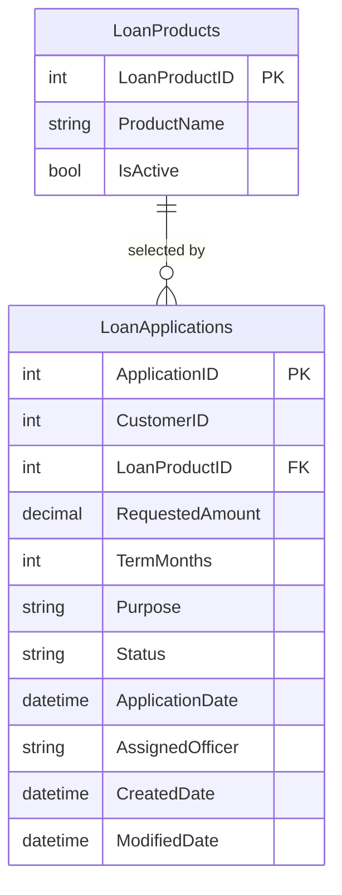

# Data Architecture & Persistence Layer

The data layer is a single SQL Server backed model accessed directly through ADO.NET in ASP.NET page code-behind files, with no ORM abstractions detected.

## Database Configuration

| Service/Module | DB Type | Profile | Driver | Connection | Migration Tool |
|---|---|---|---|---|---|
| ZavaLoanPortal | SQL Server | Default web.config | System.Data.SqlClient | `Server=sqlserver,1433;Database=ZavaBankDB;...` | None detected |

## Data Ownership per Service

| Service | Tables Owned | ORM Framework | Caching | Notes |
|---|---|---|---|---|
| ZavaLoanPortal | LoanApplications, LoanProducts | ADO.NET SqlClient | None detected | Single application owns direct reads and writes |

## Entity Model

## Key Repository Methods

| Service | Repository | Notable Methods | Purpose |
|---|---|---|---|
| ZavaLoanPortal | `Default.aspx.cs` (`BindLoanProducts`) | `SELECT LoanProductID, ProductName FROM LoanProducts WHERE IsActive=1` | Loads active loan products for UI selection |
| ZavaLoanPortal | `Default.aspx.cs` (`BindLoanHistory`) | `SELECT TOP 25 ... FROM LoanApplications ORDER BY ApplicationDate DESC` | Retrieves recent application history |
| ZavaLoanPortal | `Default.aspx.cs` (`wizLoanApplication_FinishButtonClick`) | `INSERT INTO LoanApplications (...) VALUES (...)` | Persists newly submitted applications |

## Caching Strategy

No application-level caching provider or cache-aside/read-through/write-through strategy is configured in the repository. Data is fetched directly from SQL Server on each page load and postback workflow step.

## Data Ownership Boundaries

The application uses a single shared database connection and directly accesses owned tables from the UI service layer. Cross-service data exchange with external systems occurs through HTTP integration, not direct cross-database reads.

### Data Classification & Sensitivity

| Entity | Sensitive Fields | Classification (PII/PHI/PCI/None) | Controls in Place |
|---|---|---|---|
| LoanApplications | CustomerID, AssignedOfficer, Purpose | PII | Forms auth configured; no masking or field-level encryption shown in code/config |
| LoanProducts | ProductName | None | Not applicable |
