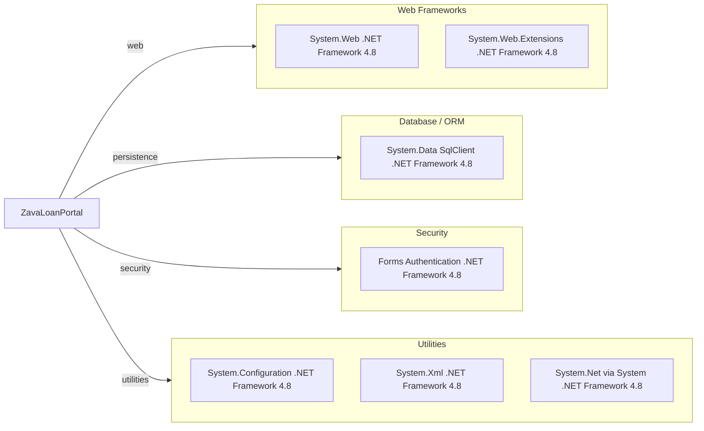

# Dependency Map

This .NET Web Forms project has a small dependency surface centered on .NET Framework assemblies and SQL Server connectivity.

## Dependencies

### Dependency Summary

| Category | Count | Key Libraries | Notes |
|---|---:|---|---|
| Web Frameworks | 2 | System.Web, System.Web.Extensions | Legacy ASP.NET Web Forms stack |
| Database / ORM | 1 | System.Data SqlClient | Direct SQL access, no ORM package |
| Security | 1 | Forms Authentication | Cookie based auth in web.config |
| Utilities | 3 | System.Configuration, System.Xml, System | Base framework functionality |

### Version & Compatibility Risks

The project targets .NET Framework 4.8, which is Windows-centric and not compatible with modern cross-platform .NET runtime deployment models without migration. The mono based Docker build indicates runtime compatibility workarounds that may increase modernization effort.

### Notable Observations

- No external NuGet packages are declared in `packages.config`; dependencies are primarily framework assemblies.
- Data access uses framework `SqlClient` directly, so modernization likely requires refactoring direct SQL usage patterns.
- Docker image relies on mono and xsp4, indicating legacy hosting assumptions.

## Test Dependencies

| Framework | Version | Notes |
|---|---|---|

Total test-scope dependencies: 0
No test dependencies detected.
