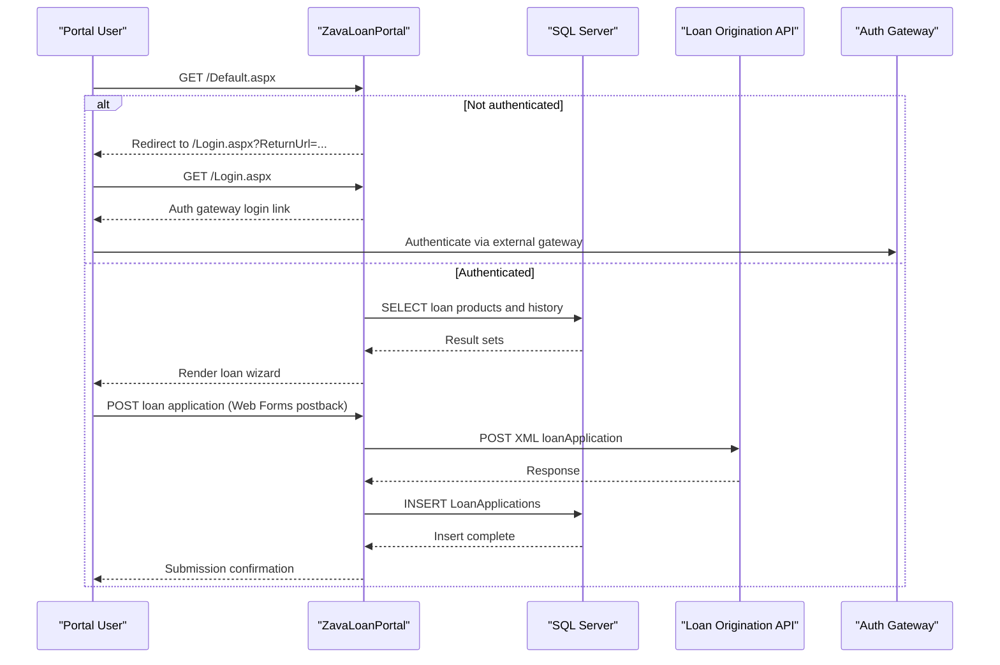

# API & Service Communication Contracts

This application exposes page-based HTTP interactions and communicates with external services using configuration-driven URLs and synchronous request/response flows.

## Service Catalog

| Service | Port | Category | Purpose |
|---|---|---|---|
| ZavaLoanPortal | 80 (container), IIS-hosted | API Layer | User-facing web portal for loan application and history |
| Zava Auth Gateway (external) | Not declared here | Infrastructure | Handles login/logout redirects |
| Loan Origination API (external) | 8080 | Business | Receives loan application payloads from portal |

## API Endpoints Inventory

| Service | Method | Path | Request Type | Response Type |
|---|---|---|---|---|
| ZavaLoanPortal | GET | /Default.aspx | Cookie-authenticated page request | HTML page |
| ZavaLoanPortal | POST | /Default.aspx | Web Forms postback fields | HTML page / status message |
| ZavaLoanPortal | GET | /Login.aspx | Query parameter `ReturnUrl` | HTML page with auth redirect link |
| ZavaLoanPortal | GET | /Logout.aspx | None | Redirect response |

## Management & Observability Endpoints

| Service | Endpoint | Custom Metrics (if any) |
|---|---|---|
| ZavaLoanPortal | None detected | None detected |

## DTOs & Contracts

No formal API DTO classes (such as C# request/response models) were detected. Contract payloads are composed inline as XML strings (`loanApplication`) and exchanged with the external loan origination API using `HttpWebRequest`. For entity field-level details, refer to `data-architecture.md`.

## Communication Patterns

Communication is synchronous: browser-to-portal page requests and portal-to-external-service HTTP calls. Loan submission posts an XML payload to `LoanOriginationApiUrl`. There are no explicit retry, timeout, circuit-breaker, service discovery, or load-balancing policies defined in code. API-level authentication is forms-auth cookie-based for portal pages; no TLS enforcement settings are explicitly configured in the examined files.

## Service Technology Matrix

| Service | Web | Data Access | Discovery | Gateway | Actuator | Cache | Metrics |
|---|---|---|---|---|---|---|---|
| ZavaLoanPortal | ASP.NET Web Forms | ADO.NET SqlClient | None | None | None | None | None |

## Service Communication Sequence

