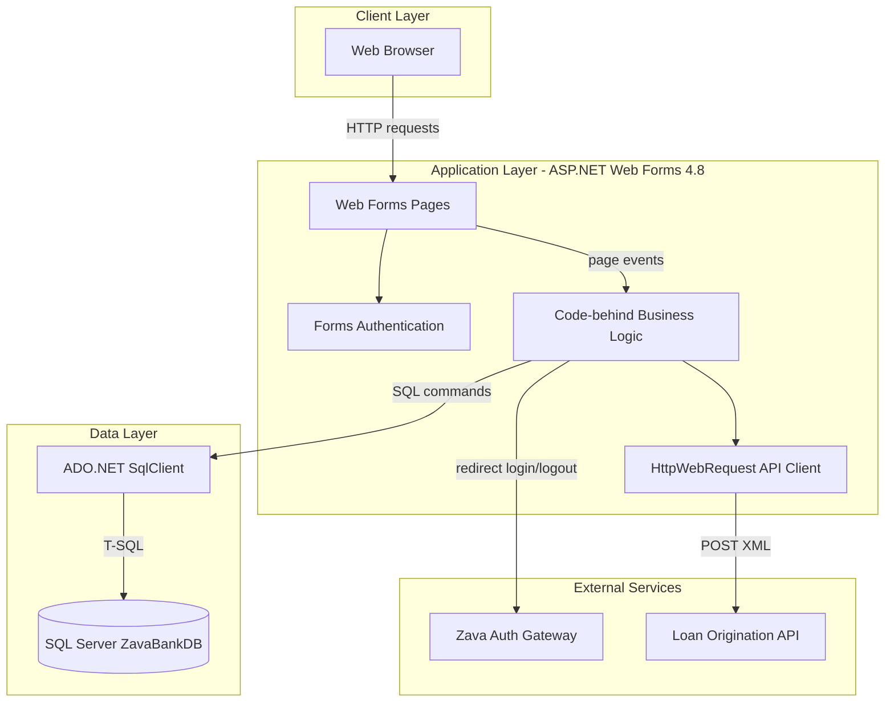
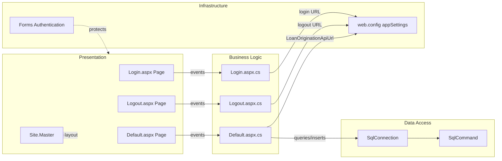

# Architecture Diagram

This .NET Framework Web Forms application provides a loan portal UI that reads/writes SQL Server data and calls external authentication and loan-origination services.

## Application Architecture

### Technology Stack Summary

| Layer | Technology | Version | Purpose |
|---|---|---|---|
| Presentation | ASP.NET Web Forms | .NET Framework 4.8 | Server-rendered loan portal UI |
| Security | Forms Authentication | .NET Framework 4.8 | Session/cookie-based portal authentication |
| Business | C# code-behind classes | .NET Framework 4.8 | Loan submission workflow and page orchestration |
| Data Access | ADO.NET SqlClient | System.Data.SqlClient | SQL queries and inserts |
| Data Storage | SQL Server | Not specified | Stores loan products and loan applications |

### Data Storage & External Services

The portal stores application and product data in a SQL Server database (`ZavaBankDb` connection string). It also depends on an external authentication gateway for login/logout redirects and a loan-origination API for POSTing loan applications.

### Key Architectural Decisions

- Uses ASP.NET Web Forms page lifecycle and server controls instead of MVC/API controllers.
- Uses direct ADO.NET SQL commands rather than a repository/ORM abstraction.
- Integrates external systems with configuration-driven URLs in `web.config`.

## Component Relationships

### Component Inventory

| Component | Layer | Type | Responsibility |
|---|---|---|---|
| Default.aspx / Default.aspx.cs | Presentation + Business | Web Forms page + code-behind | Loan application wizard, product/history data binding, loan submission |
| Login.aspx / Login.aspx.cs | Presentation + Business | Web Forms page + code-behind | Redirects users to external auth gateway login |
| Logout.aspx / Logout.aspx.cs | Presentation + Business | Web Forms page + code-behind | Signs out and redirects to external logout endpoint |
| Site.Master | Presentation | Master page | Shared UI shell for portal pages |
| SqlConnection / SqlCommand | Data Access | ADO.NET components | Executes SQL reads/writes to SQL Server |
| Forms authentication config | Infrastructure | ASP.NET auth configuration | Enforces authenticated access except login/logout pages |
