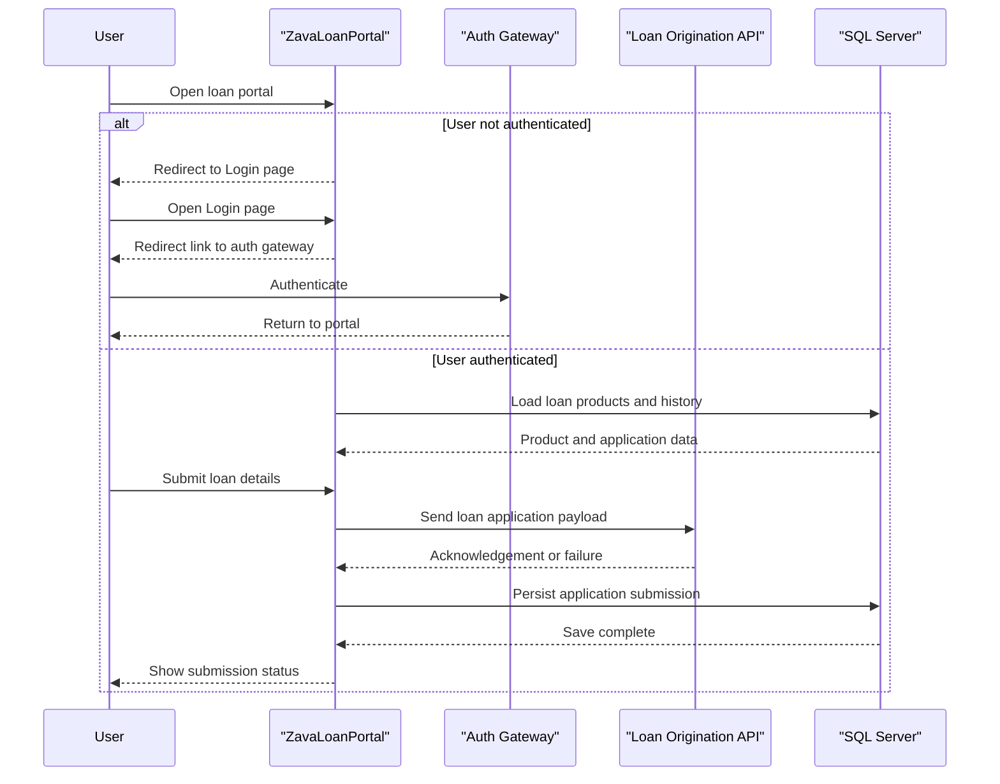

# Core Business Workflows

The application supports loan-portal user activities: authenticate, review available products and prior applications, and submit a new loan request.

## Domain Entities

| Entity | Service / Bounded Context | Description | Key Relationships |
|---|---|---|---|
| LoanApplication | Loan Intake (ZavaLoanPortal) | User-submitted loan request and processing state | Linked to Customer and LoanProduct |
| LoanProduct | Product Catalog (ZavaLoanPortal) | Selectable loan offering for application submission | Referenced by LoanApplication |
| Customer | Customer Context (upstream/portal-linked) | Applicant identity used when creating applications | Parent context for LoanApplication |

## Service-to-Domain Mapping

| Service | Domain Context | Owned Entities | External Dependencies |
|---|---|---|---|
| ZavaLoanPortal | Loan Intake UI | LoanApplication workflow state and page interactions | SQL Server, Auth Gateway, Loan Origination API |

## Primary Workflows

### Workflow 1: Authenticate and access portal

1. User navigates to `/Default.aspx`.
2. If not authenticated, portal redirects to `/Login.aspx` with return URL.
3. Login page provides redirect link to auth gateway.
4. After authentication, user returns and accesses protected portal pages.

### Workflow 2: Submit loan application

1. User reviews products and history on the default page.
2. User enters loan details and advances wizard steps.
3. Portal validates key numeric values before finish.
4. Portal posts loan XML payload to external origination API.
5. Portal stores submitted application in SQL Server and shows confirmation.

## Cross-Service Data Flows

The portal composes data from internal SQL Server reads (products/history) and external service interactions. Authentication flow relies on redirects to the auth gateway, while submission flow calls the loan origination API and then persists local state. If the external loan API call fails, the current implementation swallows exceptions and continues, creating possible business-process degradation visibility gaps.

## Business Workflow Sequence

## Business Rules & Decision Logic

- Access control rule: anonymous users are denied except login/logout pages.
- Validation rule: requested amount and term must parse as numeric values before final submission step.
- Submission rule: loan payload is sent to external origination API and application is then inserted as `Submitted` in local data store.
- State behavior: newly created records use submission timestamp and assigned officer from the authenticated user identity.
