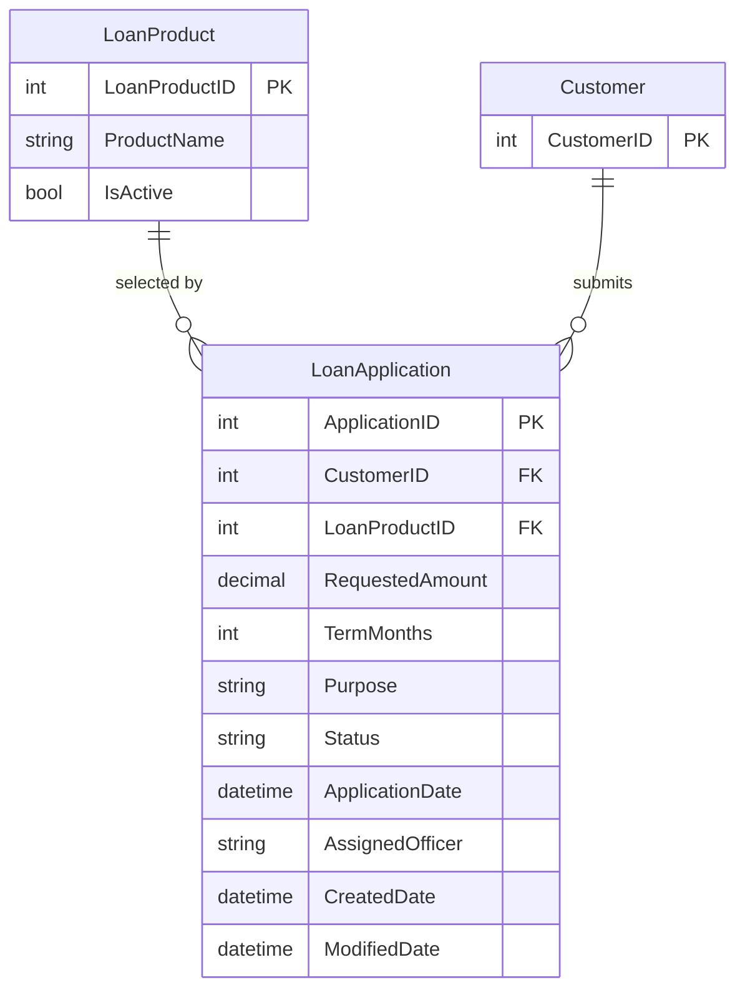

# Data Architecture & Persistence Layer

The data layer uses direct ADO.NET access to a SQL Server database with persistence logic embedded in Web Forms code-behind classes.

## Database Configuration

| Service/Module | DB Type | Profile | Driver | Connection | Migration Tool |
|---|---|---|---|---|---|
| ZavaLoanPortal | SQL Server | Default (web.config) | System.Data.SqlClient | `ZavaBankDb` connection string in `web.config` | None detected |

## Data Ownership per Service

| Service | Tables Owned | ORM Framework | Caching | Notes |
|---|---|---|---|---|
| ZavaLoanPortal | LoanApplications, LoanProducts (queried/updated) | ADO.NET (no ORM) | None detected | SQL commands embedded in page code-behind |

## Entity Model

## Key Repository Methods

| Service | Repository | Notable Methods | Purpose |
|---|---|---|---|
| ZavaLoanPortal | Inline SQL in `Default.aspx.cs` | `BindLoanProducts()` | Reads active loan products for dropdown binding |
| ZavaLoanPortal | Inline SQL in `Default.aspx.cs` | `BindLoanHistory()` | Reads recent submitted applications for history grid |
| ZavaLoanPortal | Inline SQL in `Default.aspx.cs` | Insert command in `wizLoanApplication_FinishButtonClick` | Persists new loan application record |

## Caching Strategy

No application-level caching framework or cache configuration was detected. Data is read directly from SQL Server for each page load and write operation.

## Data Ownership Boundaries

The application uses a single database connection and directly accesses loan product and loan application data from the portal code. No separate service-owned databases, CQRS separation, or event-driven persistence boundaries were identified.

### Data Classification & Sensitivity

| Entity | Sensitive Fields | Classification (PII/PHI/PCI/None) | Controls in Place |
|---|---|---|---|
| LoanApplication | CustomerID, AssignedOfficer, Purpose | PII (indirect/user-linked) | No encryption or masking controls detected in project config |
| Customer | Identifier reference only (`CustomerID`) | PII (identifier reference) | No explicit field-level controls detected |
| LoanProduct | Product metadata | None | N/A |
