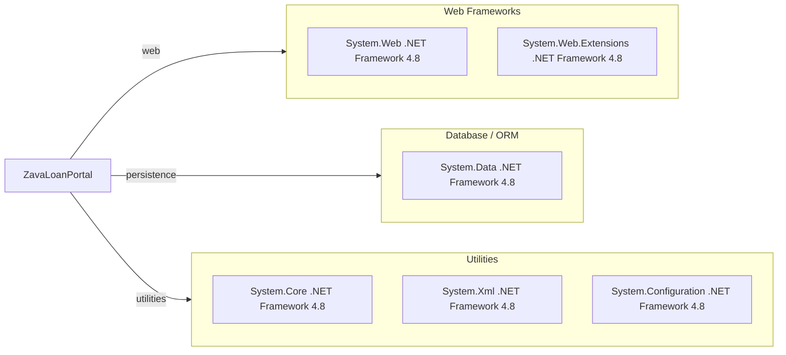

# Dependency Map

This project (`ZavaLoanPortal`) declares a minimal external dependency footprint, relying primarily on .NET Framework base assemblies.

## Dependencies

### Dependency Summary

| Category | Count | Key Libraries | Notes |
|---|---:|---|---|
| Web Frameworks | 2 | System.Web, System.Web.Extensions | ASP.NET Web Forms on .NET Framework |
| Database / ORM | 1 | System.Data | Direct ADO.NET data access |
| Utilities | 3 | System.Core, System.Xml, System.Configuration | Base framework libraries |

### Version & Compatibility Risks

The project targets .NET Framework 4.8, which is Windows-centric and not cross-platform. Modernization to current .NET requires migration away from Web Forms and some framework-bound APIs.

### Notable Observations

- No third-party NuGet packages are declared in `packages.config`.
- Data access is built on direct SQL via framework libraries, not an ORM package.
- Dependency surface is small, but tied to legacy ASP.NET Web Forms runtime.

## Test Dependencies

No test dependencies detected.

Total test-scope dependencies: 0

No test infrastructure dependencies are declared in build/package files.
